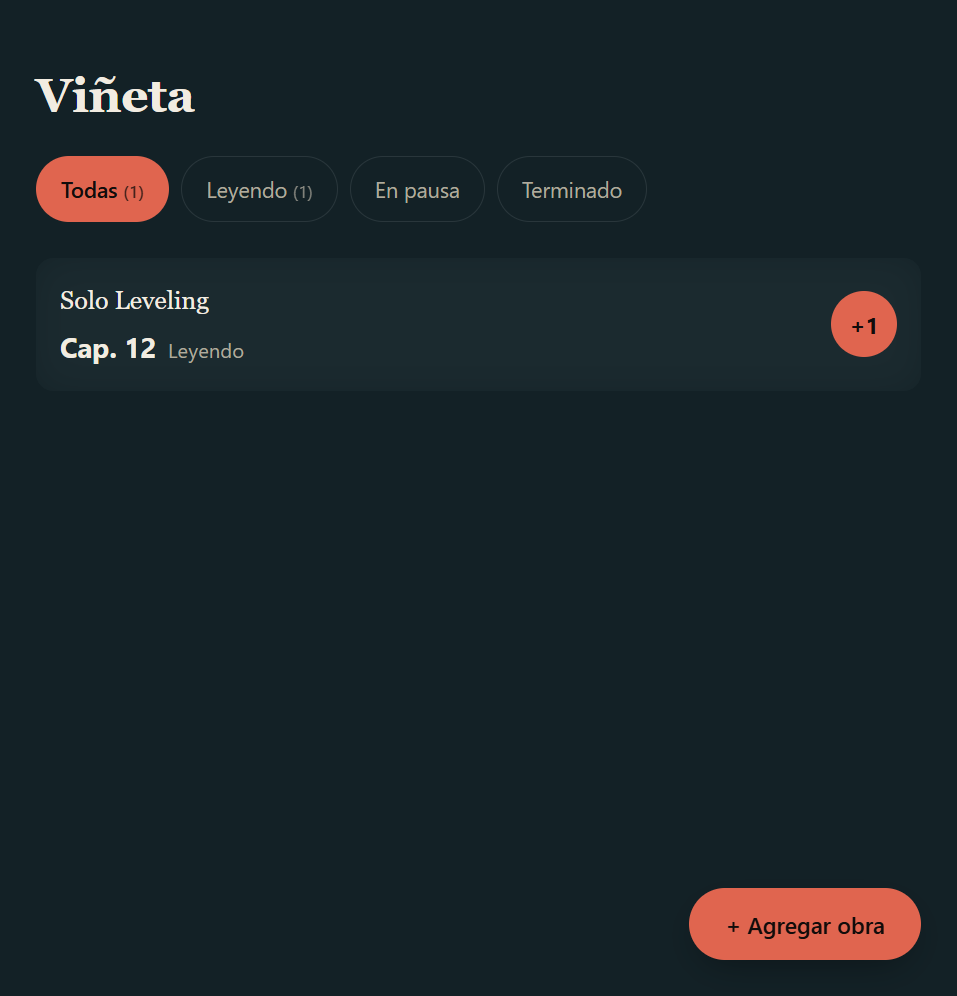

# Viñeta

Registro personal de lecturas — manhwa, manga, cómics, novelas y libros. Sabés en qué capítulo vas
de cada uno y lo avanzás con un toque.



## Qué hace

- **Agregá una obra** con su título, el capítulo en que vas y su estado (Leyendo / En pausa / Terminado).
- **Sumá un capítulo con un toque** — el botón **+1** lo hace al instante, con un aviso para deshacer.
- **Filtrá** tu lista por estado, con un contador al lado de cada filtro.

Nada más. Sin cuentas, sin anuncios, sin conexión a ningún servidor: **todo se guarda en tu propio
navegador** y la app funciona sin internet después de la primera visita (es una PWA instalable).

## Cómo correrla en tu máquina

No hay build ni dependencias de npm. Como usa módulos de JavaScript (`type="module"`) y un service
worker, **no funciona abierta como archivo (`file://`)** — hace falta servirla por HTTP:

```bash
npx serve .
# o cualquier servidor estático: python -m http.server, live-server, etc.
```

Abrí la URL que te dé el servidor (por ejemplo `http://localhost:3000`).

## Cómo correr las pruebas

```bash
npm test
```

Corre `node --test` sobre `tests/obras.js` y `tests/almacen.js` — la lógica de negocio, sin
necesidad de abrir un navegador. Node **no** es parte de la app publicada: solo se usa acá, en
desarrollo, para automatizar estas pruebas.

## Estructura del proyecto

```
vineta/
├── index.html              Estructura de la página
├── estilos.css              Identidad visual, temas claro y oscuro
├── app.js                   Interfaz — el único archivo que toca el DOM
├── obras.js                 Reglas puras: validar, sumar capítulo, filtrar, ordenar
├── almacen.js                Leer y guardar en localStorage
├── sw.js                    Service worker (funcionamiento sin conexión)
├── manifest.webmanifest     Metadatos para instalar la app
├── iconos/                  Ícono de la app (SVG + PNG en varios tamaños)
├── tests/                   Pruebas automáticas (node --test)
└── docs/
    ├── SRS.md                Especificación de requerimientos completa
    ├── clausulas.md          Reglas fijas del proyecto
    └── pactos/               Historias de usuario, criterios de aceptación y su seguimiento
```

## Documentación

El porqué y el cómo de cada decisión están en [`docs/SRS.md`](docs/SRS.md) (visión, roles,
requerimientos funcionales y no funcionales, arquitectura, casos borde) y en
[`docs/pactos/`](docs/pactos/) (historias de usuario, criterios de aceptación y qué se probó de
cada una).

## Identidad: "Viñeta fotográfica"

El nombre juega con las dos acepciones de "viñeta": el cuadro de un cómic y el efecto de sombreado
difuminado en el borde de una fotografía vieja. Cada tarjeta de obra lleva ese difuminado — como si
fuera un recorte de una historia más grande.
